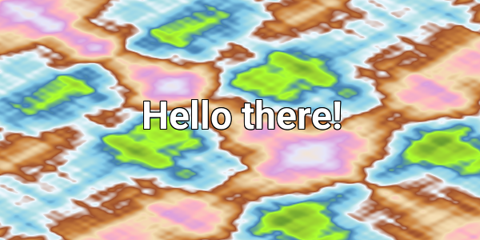

# Text to Image

This is a simple command line tool built in `go` which is used to render text as an image or a gif.

## Project Directory Structure

```
tti/
├── main.go              # Entry point and CLI parsing
├── config.go            # Configuration and mappings
├── font.go              # Font management
├── background.go        # Background generation
├── text_renderer.go     # Text rendering effects
├── image_generator.go   # Image/GIF generation
├── go.mod               # Go module definition
├── go.sum               # Dependencies checksum
└── assets/
    └── text/
    |   ├── Roboto-Bold.ttf
    |   ├── Roboto-Regular.ttf
    |   └── ... (other TTF files)
    └── LICENSE/
        └── OFL.txt (open font license.txt)
```

## Fonts used
This project uses fonts from Google Fonts under their respective licenses. See `assets/LICENSE/OFL.txt` for more information

## Getting started

> Note: Make sure you have `go` installed

```bash
    # clone the repository
    git clone https://github.com/khethan-god/tti.git

    # move to the repository
    cd tti

    # Build the binary file
    go build   # create a tti executable

    # run the binary/executable file
    ./tti "Hello World"
```


This tool also has the following flags which can be used if you find the defaults not to your taste

```bash
    -width      # positive integer
    -height     # positive integer
    -font-size  # positive integer
    -font       # accepts text values, you can use any key present in config.go file's fontMap
    -bg         # [default, perlin, perlin-s, radial, diagonal]
    -output     # directory where you want to store the GIFs/images
    -reveal-bg  # makes text colorful and background white
    -animate    # creates a GIF
```

## Examples

```bash
./tti -bg=perlin-s "Hello there!
```
<p align="center">
    
</p>

```bash
./tti -animate "Hello there!
```
<p align="center">
    
</p>


### TODO
---
Need to add support for emoji rendering

### License
---
Distributed under MIT license. See `LICENSE` for more information